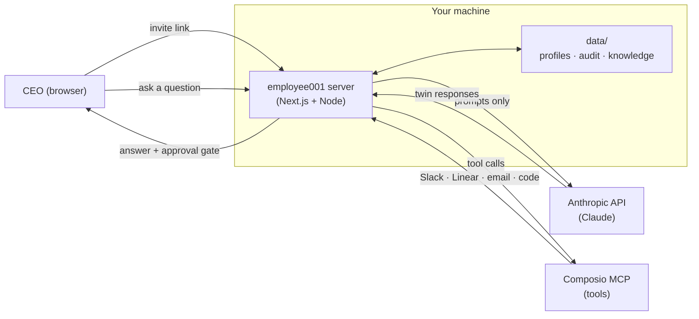

# Employee001

> Your company's organizational brain — agent twins of your real employees, running entirely on **your own machine**.

[](https://www.npmjs.com/package/employee001)
[](https://www.npmjs.com/package/employee001)
[](https://github.com/dolevhayut/Employee001/actions/workflows/ci.yml)
[](https://opensource.org/licenses/MIT)
[](https://nodejs.org)

| Employees roster | Twin chat | Settings |
|---|---|---|
|  |  |  |

## Install

```bash
npx employee001 setup
npx employee001 start
```

Then open <http://localhost:3000>.

Requires Node.js 22+, an Anthropic API key, and a Composio API key (for MCP tool integrations). All data stays in `./data/` on your machine. MIT licensed. No telemetry. No cloud.

## What it does

- **Agent twins for every employee** — always-on AI twins of the people who actually work at your company.
- **Twin council meetings** — ask one question, the right twins debate and converge.
- **Real tool execution** — twins draft Slack messages, file Linear tickets, send emails, push code, through Composio MCP.
- **Org Brain** — one shared knowledge graph every twin reads from.
- **On-prem by design** — runs on your Mac mini (or any machine with Node 22). Bound to `127.0.0.1` by default.
- **Human-controlled autonomy** — every sensitive action hits an approval gate before it runs.

## Why not ChatGPT Teams or Copilot?

Those tools give your employees AI. Employee001 gives your company AI — twins that represent specific people, carry institutional knowledge, and can act on your behalf through real tools.

The bigger difference: **your data never leaves your machine.** ChatGPT Teams and Copilot send every conversation to OpenAI or Microsoft. Employee001 sends only the prompts you explicitly generate to Anthropic. Employee profiles, org knowledge, audit logs — all stay on your hardware.

This matters if you're a law firm, a fund, an agency, or any team where client confidentiality isn't optional.

## How it works



Data flow in plain English:
1. **CEO invites employees** — each employee fills a profile form, saved as a markdown file in `data/employees/`
2. **CEO asks a question** — routed to one or more twins based on expertise
3. **Twin(s) reason** — using Claude, reading from `data/` knowledge graph
4. **Tool calls** — if a twin wants to send a Slack message, file a ticket, etc., it goes through Composio MCP; CEO approves before execution
5. **Nothing persists outside `data/`** — no external database, no analytics

## Commands

| Command | What it does |
|---|---|
| `npx employee001 setup` | Interactive first-run wizard. Writes `.env`, creates `data/`. |
| `npx employee001 start` | Starts the local server. Opens browser. |
| `npx employee001 update` | Checks GitHub releases for a newer version. |
| `npx employee001 doctor` | Health check — Node version, env, API keys, port. |
| `npx employee001 help` | Show help. |

Flags for `start`:
- `--no-open` — don't open the browser
- `--port <n>` — override the port

## Where your data lives

```
./
├── .env          # your API keys (chmod 600)
└── data/
    ├── employees/        # markdown profile files per twin
    ├── audit.jsonl       # every tool call, every approval
    ├── routines.json     # scheduled work
    ├── hired-agents.json # marketplace hires
    └── task-history.jsonl
```

Nothing in `data/` is ever sent anywhere except to the Anthropic API (only the prompts that twins generate when you ask them to do work). No telemetry. No analytics. No "phone home".

## Network exposure

By default, the server binds to `127.0.0.1` — only this machine can reach it, and the OS itself is the access boundary.

To expose on your LAN (e.g., for a Mac mini in the office serving the whole team):

```bash
EMPLOYEE001_BIND=0.0.0.0 npx employee001 start
```

When bound to anything other than `127.0.0.1`, every request must carry a shared-secret token. `npx employee001 setup` generates one (`EMPLOYEE001_TOKEN` in `.env`) automatically. `start` prints the access URL on boot — visit it once from each device on your LAN:

```
http://<mac-mini>:3000/?token=<your-token>
```

The token is then set as an `e001_token` httpOnly cookie for 30 days. API calls without a matching cookie return `401`.

> **Still: use a firewall or Tailscale.** The token gates HTTP access, but the app itself is not hardened for the public internet. Don't put this on a port-forwarded box.

To rotate the token, delete the line from `.env` and re-run `setup`.

## Open-core

100% of the code in this repo is MIT-licensed and free. Everything you see in the product is available to you.

**Premium = services**, not features:
- Professional onboarding (we install it for you, set up MCP connections, train your team)
- SLA support with dedicated Slack channel
- Custom integrations

If that's interesting, [open a discussion](https://github.com/dolevhayut/Employee001/discussions) or email office@bulldog-adv.com.

## Stack

- [Next.js 16](https://nextjs.org) (App Router, RSC, standalone output)
- [Claude Agent SDK](https://www.anthropic.com) (Anthropic) for reasoning + tool use
- [Composio MCP](https://composio.dev) for tool integrations
- JSON files on disk for state (SQLite migration coming)

## Contributing

PRs welcome. See [CONTRIBUTING.md](./CONTRIBUTING.md) for setup, the rules of the road (no telemetry, no paid gates, no cloud dependencies), and how to file a security issue.

Maintainers: see [RELEASING.md](./RELEASING.md) for the tag-driven publish flow.

## License

MIT © Dolev Hayut
