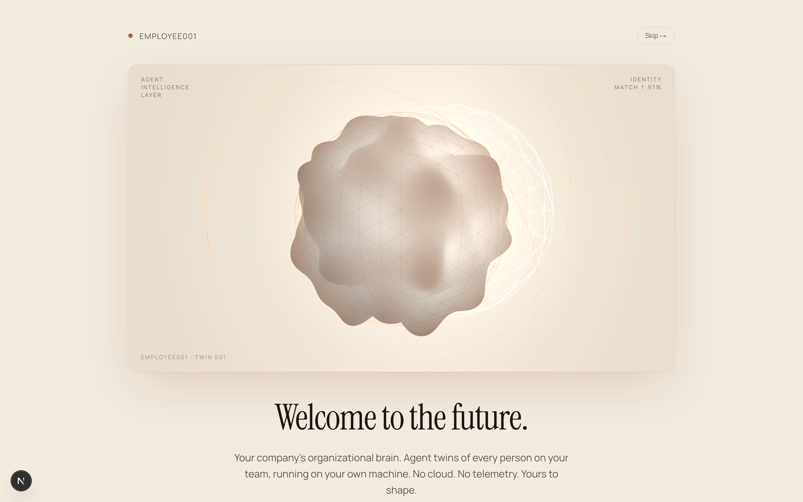
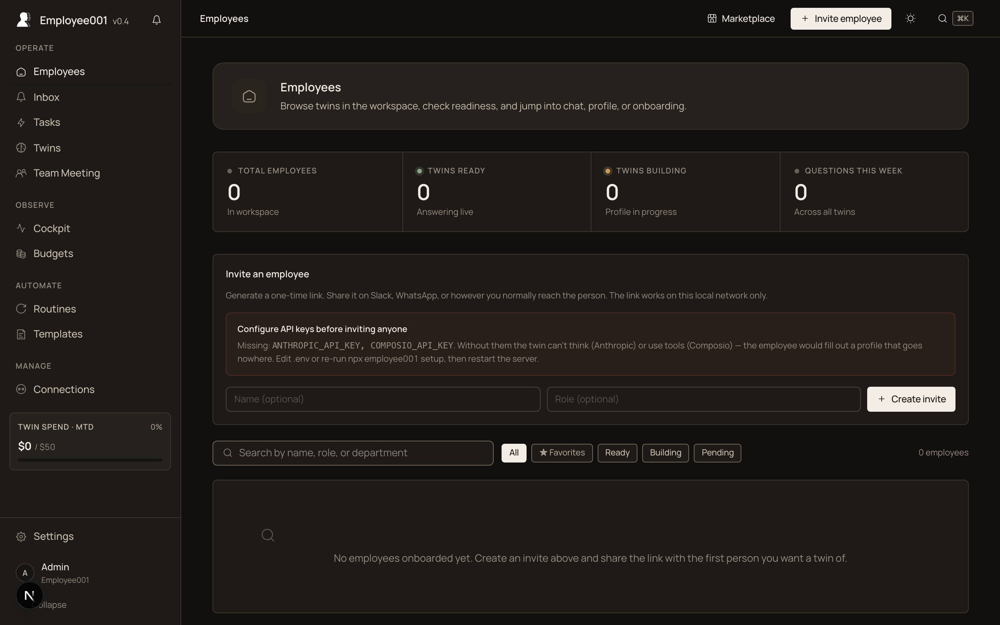
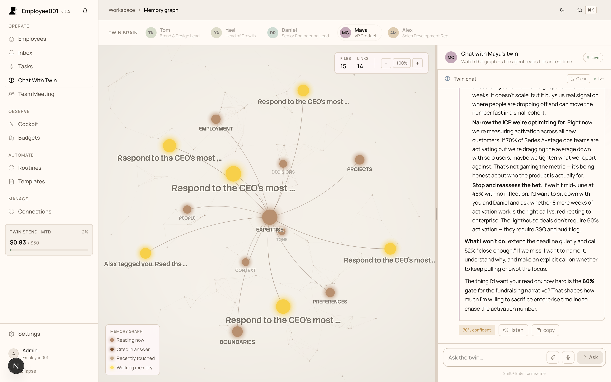
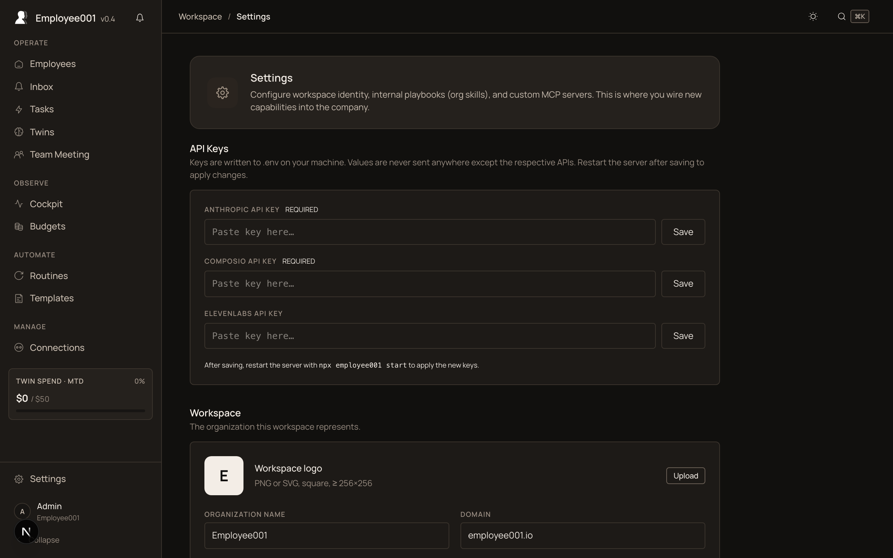
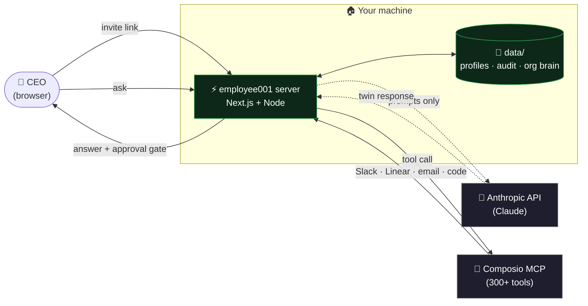
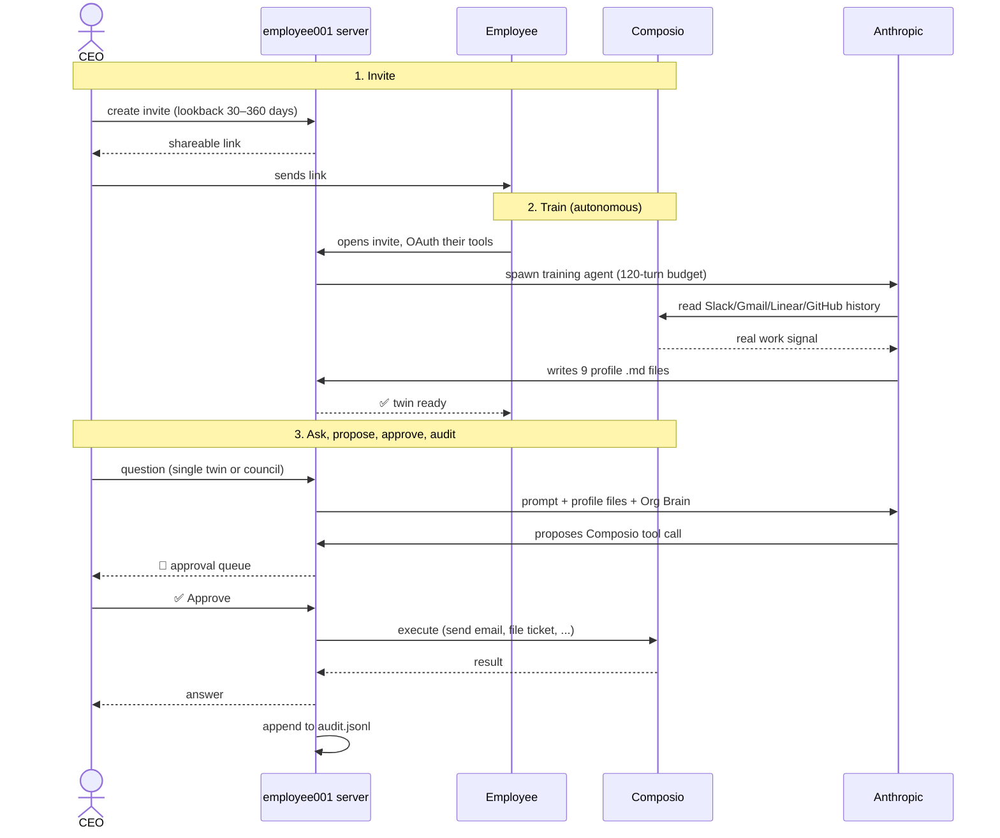
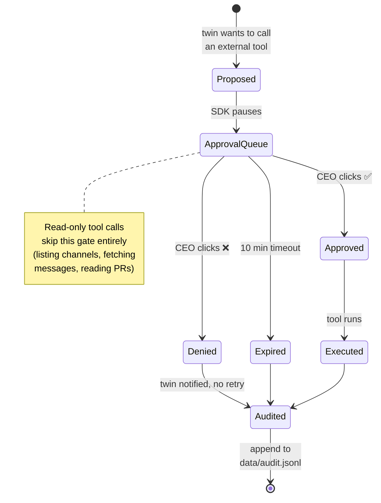

<div align="center">

# Employee001

### Your organizational brain.

**Agent twins of your real employees** — running entirely on your own machine, sharing one knowledge layer, executing real work through real tools.

[](https://www.npmjs.com/package/employee001)
[](https://www.npmjs.com/package/employee001)
[](https://github.com/dolevhayut/Employee001/actions/workflows/ci.yml)
[](https://opensource.org/licenses/MIT)
[](https://nodejs.org)
[](https://github.com/dolevhayut/Employee001/discussions)

[**Install**](#install) · [**A council in 30 seconds**](#a-council-in-30-seconds) · [**How it works**](#how-it-actually-works) · [**Vs. alternatives**](#vs-other-ai-for-teams-products) · [**Security model**](#what-twins-can-and-cant-do)

</div>

<table>
  <tr>
    <td></td>
    <td></td>
  </tr>
  <tr>
    <td></td>
    <td></td>
  </tr>
</table>

## Install

```bash
npx employee001 setup     # interactive first-run wizard
npx employee001 start     # opens http://localhost:3000
```

> [!NOTE]
> Requires **Node.js 22+** and an [Anthropic API key](https://console.anthropic.com). A [Composio API key](https://app.composio.dev) is needed when you invite a real employee for training — marketplace agents work without it. Press <kbd>Ctrl</kbd>+<kbd>C</kbd> to stop the server.

> [!IMPORTANT]
> **Your data never leaves your machine.** Only the prompts a twin generates are sent to the Anthropic API. Employee profiles, audit logs, org knowledge — all of it stays in `./data/` on your hardware. No telemetry, no analytics, no "phone home".

## What it is

|  | |
|---|---|
| 🧠 | **Your organizational brain.** Scattered expertise, past decisions, and work patterns become one living layer your company can query, trust, and grow. |
| 👤 | **A twin for every employee.** Always-on AI agents that understand a specific person's role, context, tone, and prior work — not generic role templates. |
| 💬 | **Multi-twin council meetings.** Ask one question and the right twins debate, challenge each other, and converge on a shared answer. |
| 🔌 | **Connected to how people actually work.** Email, calendar, docs, Slack, Linear, GitHub, CRM — through [Composio MCP](https://composio.dev), the same tools your people already use. |
| ⚡ | **Knowledge → execution.** Twins draft Slack messages, file Linear tickets, send emails, follow up — each action gated by your approval. |
| 🏠 | **Local-first by default.** Runs on your Mac mini (or any Node 22 machine). Bound to `127.0.0.1`. Only prompts leave, only to Anthropic. |

## A council, in 30 seconds

> **You:** What should we do before launching the new customer onboarding flow?

| Twin | Tools | Says |
|---|---|---|
| 🟠 **Dana** · Product | Linear, Slack | Risks first — the new flow touches activation. Let's pull last quarter's drop-off points. |
| 🔵 **Arie** · Engineering | GitHub, Linear | DB migration ships Thursday. Day-1 launch blocks if rollback isn't tested. |
| 🟣 **Noa** · Sales | Slack, Monday | Two enterprise demos this week. Defer = revenue at risk. Stage launch? |
| 🟢 **Tamar** · Support | ClickUp, Slack | Need help docs + macros ready, or the queue floods. 2 days of work. |

> [!TIP]
> **Verdict.** Stage launch to 10% next Tuesday after migration rollback test. Sales keeps demos; Support ships docs + macros by Monday.

Each speaker is grounded in their own profile files (`EXPERTISE.md`, `DECISIONS.md`, `CONTEXT.md`, ...) and can call real tools to back up claims. Full transcript exports as markdown.

## How it actually works



### The five steps end-to-end



## Vs. other AI-for-teams products

|  | ChatGPT Teams / Copilot | Cabinet[^1] | Paperclip[^2] | **Employee001** |
|---|---|---|---|---|
| Who the agent represents | Generic assistant | Generic role templates | Configurable AI "employees" | **A twin of a real, named person** |
| Where data lives | OpenAI / Microsoft cloud | One founder's laptop | Managed cloud or self-host | **Your machine. Prompts only leave, only to Anthropic** |
| Multi-twin reasoning | — | — | Task routing | **Council debates — twins challenge each other** |
| Tool execution | Limited connectors | CLI in a terminal | Adapters to external agents | **Native MCP + approval gate on every external action** |
| Org-wide knowledge | Conversation history | Personal notebook | Task/spend dashboards | **Org Brain — what one twin learns, the rest inherit** |

[^1]: Comparison reflects public information about Cabinet ([hilash/cabinet](https://github.com/hilash/cabinet), MIT-licensed) as of May 2026.
[^2]: Comparison reflects public information about Paperclip ([paperclip.inc](https://paperclip.inc), MIT-licensed) as of May 2026.

## Built around how people actually work

<div align="center">

📧 Email · 📅 Calendar · 📄 Documents · 💬 Chat · ✅ Tasks<br/>
💻 Code repositories · 🛍️ CRM · 📚 Knowledge bases · 🔧 Internal tools

</div>

Connected through [Composio MCP](https://composio.dev) — **300+ toolkits**, OAuth per employee (the employee authorizes their own twin, not the CEO on their behalf), token refresh handled automatically. Add a custom MCP server with Bearer auth or full OAuth from `/settings` — Apify, Stripe, Firecrawl, Higgsfield, anything that speaks MCP.

## What twins can and can't do

Twins run on the [Claude Agent SDK](https://docs.claude.com/en/api/agent-sdk/overview). Permissions are deliberate and identical for every twin in every workspace.

### The approval gate, visually



### Hard-disallowed everywhere — no twin can call these, ever

```
Bash · NotebookEdit · EnterWorktree · ExitWorktree
```

No twin runs shell commands on your machine. Enforced in two places at once (the SDK's `disallowedTools` plus a defensive `PreToolUse` hook).

<details>
<summary><b>📋 Detailed permissions per run type</b> (click to expand)</summary>

| Run type | Built-in tools | External tools |
|---|---|---|
| **Twin chat** | `Read`, `Glob`, `Grep`, `Write`¹, `WebSearch`, `WebFetch`, `Task`², `TodoWrite`, `AskUserQuestion` | Composio³ |
| **Twin training** | `Read`, `Write`¹, `Glob`, `Grep`, `TodoWrite` | Composio³ (read-only signal — Slack/Gmail/Linear/GitHub history) |
| **Scheduled routines** | `TodoWrite` | Composio³ |
| **Org-brain summarisation** | — none — | — none — |

¹ `Write` is sandboxed to `data/scratch/<employee-id>/`. A twin can jot a memo or draft — it **cannot** overwrite its own profile, the org brain, audit logs, or any other file under `data/`. Path traversal is rejected.

² `Task` spawns one of two restricted sub-agents: a **web-researcher** (only `WebSearch` + `WebFetch`) or a **brain-explorer** (only `Read` + `Glob` + `Grep`). Sub-agents inherit the same hard-disallow list.

³ Composio MCP tools are *external-effect* tools — posting to Slack, sending Gmail, opening GitHub PRs. Every call hits the approval gate above. Auto-execution is off by default. Read-only Composio calls run without prompting.

**Audit trail.** Every tool call — built-in or Composio — is appended to `data/audit.jsonl` with the run id, the employee id, the tool name, the input, and the verdict (`executed` / `ceo_approved` / `ceo_denied` / `hard_blocked`). Browseable from `/audit`.

**Web citations.** After any `WebSearch` or `WebFetch`, a `PostToolUse` hook injects an instruction telling the model to cite the URL and the fetch date. Twins can look things up online, but they can't pretend they "just knew" something.

**Models.** `claude-sonnet-4-6` default with `claude-sonnet-4-5` fallback. Override to `claude-opus-4-7` for a single message from the chat UI. Source of truth: [`src/lib/sdk-defaults.ts`](src/lib/sdk-defaults.ts).

</details>

## Where your data lives

```
./
├── .env                  # your API keys (chmod 600)
└── data/
    ├── employees/<id>/   # 9 markdown profile files per twin
    ├── org/              # Org Brain (shared knowledge graph)
    ├── audit.jsonl       # every tool call, every approval
    ├── routines.json     # scheduled work
    ├── hired-agents.json # marketplace hires
    └── memory/<id>/      # per-twin episodic memory
```

> [!TIP]
> `npx employee001 export ~/Desktop/e001-backup.tar.gz` snapshots everything except secrets. `npx employee001 import <archive>` restores on a fresh install.

## Network exposure

By default the server binds to `127.0.0.1` — only this machine can reach it, OS access control is the boundary.

For a LAN-shared install (e.g. Mac mini in the office serving the whole team):

```bash
EMPLOYEE001_BIND=0.0.0.0 npx employee001 start
```

When bound to anything other than loopback, every request must carry a shared-secret token. `setup` generates one (`EMPLOYEE001_TOKEN` in `.env`); `start` prints the access URL on boot. Visit it once from each device — the token becomes a 30-day `e001_token` httpOnly cookie. API calls without a matching cookie return `401`.

Invite tokens are carve-outs — they bypass the LAN gate for `/join`, `/onboarding`, and `/api/invites/<token>` only, so employees can onboard without holding the workspace secret.

> [!WARNING]
> Use a firewall or [Tailscale](https://tailscale.com). The token gates HTTP access, but the app is not hardened for the public internet. **Don't put this on a port-forwarded box.**

## Commands

| Command | What it does |
|---|---|
| `npx employee001 setup` | Interactive first-run wizard. Writes `.env`, creates `data/`. |
| `npx employee001 start` | Starts the local server. Opens browser. `--no-open` / `--port <n>` flags. |
| `npx employee001 doctor` | Health check — Node version, env, API keys, port, build. |
| `npx employee001 update` | Checks GitHub releases for a newer version. |
| `npx employee001 export <path>` | Snapshot `data/` to a tar.gz (excludes secrets). |
| `npx employee001 import <path>` | Restore `data/` from a tar.gz. `--force` overwrites. |
| `npx employee001 help` | Show help. |

## Status

The product has shipped the core loop end-to-end. Tracking against the public roadmap:

- [x] Twin chat with profile-file citations (`/flow`)
- [x] Composio MCP integration (Slack, Gmail, GitHub, Linear, Calendar, Drive)
- [x] Approval gate on every external tool call
- [x] In-UI profile editing of the 9 markdown files
- [x] Per-invite training window (30–360 days)
- [x] Multi-twin council debates (`/council`)
- [x] Scheduled routines (`/routines`)
- [x] Marketplace agents (pre-built SDR/DevOps/Writer/Analyst/CSM)
- [x] Custom MCP servers with OAuth bridge (`/settings`)
- [x] Backup / export / import
- [x] Org-brain search across twin profiles
- [ ] Voice playback for twin answers (ElevenLabs)
- [ ] Hebrew + i18n
- [ ] Multi-CEO / multi-tenant
- [ ] Mac DMG / Electron wrapper for non-technical CEOs

## Open-core

100% of the code in this repo is MIT-licensed and free. Everything you see in the product is available to you.

**Premium = services**, not features:

- Professional onboarding — we install it for you, set up MCP connections, train your team
- SLA support with a dedicated Slack channel
- Custom integrations

If that's interesting, [open a discussion](https://github.com/dolevhayut/Employee001/discussions) or email <a href="mailto:office@bulldog-adv.com">office@bulldog-adv.com</a>.

<details>
<summary><b>☁️ Cloud edition (planned, separate)</b></summary>

This repository is the **local-first OSS edition**. A managed cloud edition is on the roadmap as a **separate product** — for teams that want long-running shifts, audit logs in a hosted console, private MCP networks, and don't want to run their own Mac mini.

The cloud edition will be a paid service, **not a feature gate on this code**. Everything you see in the repo today stays MIT and local-first.

</details>

## Stack

- [Next.js 16](https://nextjs.org) (App Router, RSC, standalone output)
- [Claude Agent SDK](https://docs.claude.com/en/api/agent-sdk/overview) for reasoning + tool use
- [Composio MCP](https://composio.dev) for tool integrations (300+ toolkits)
- JSON-on-disk for state — no database

## Contributing

PRs welcome. See [CONTRIBUTING.md](./CONTRIBUTING.md) for setup, the rules of the road (no telemetry, no paid feature gates, no cloud dependencies), and how to file a security issue.

Maintainers: see [RELEASING.md](./RELEASING.md) for the tag-driven publish flow.

## License

MIT © [Dolev Hayut](https://github.com/dolevhayut)

<div align="center">

⭐ **If Employee001 sounds useful, [star the repo](https://github.com/dolevhayut/Employee001) — it helps others find it.** ⭐

</div>
